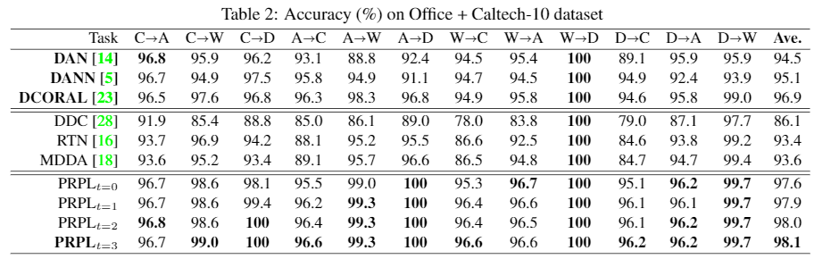
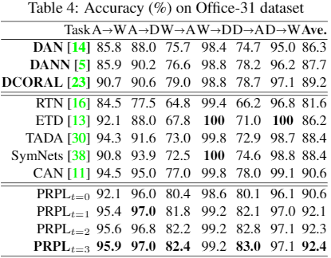
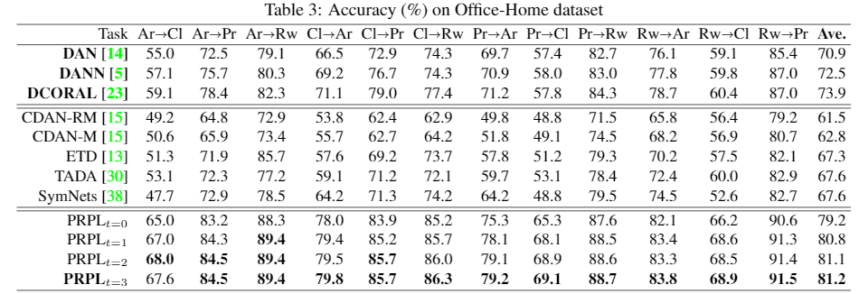

# Efficient Pre-trained Features and Recurrent Pseudo-Labeling in Unsupervised Domain Adaptation
<!--  <hr width=”200″ align=”left”>  -->
This directory contains the code for paper [Efficient Pre-trained Features and Recurrent Pseudo-Labeling in Unsupervised Domain Adaptation](https://www.researchgate.net/publication/351118254_Efficient_Pre-trained_Features_and_Recurrent_Pseudo-Labeling_in_Unsupervised_Domain_Adaptation), which is accepted by in 2021 CVPR Workshops (CVPRW).


If you have any questions, please email to yoz217@lehigh.edu
### Reference

If you find it is helpful, please cite it as:

`
Zhang, Youshan, and Brian D. Davison. (2021). Efficient Pre-trained Features and Recurrent Pseudo-Labeling inUnsupervised Domain Adaptation. In 2021 IEEE/CVF Conference on Computer Vision and Pattern Recognition Workshops (CVPRW), pp. 2719-2728. 2021.
`


Or in bibtex style:

```
@inproceedings{zhang2021efficient,
  title={Efficient Pre-trained Features and Recurrent Pseudo-Labeling in Unsupervised Domain Adaptation},
  author={Zhang, Youshan and Davison, Brian D},
  booktitle={Proceedings of the IEEE/CVF Conference on Computer Vision and Pattern Recognition (CVPR) Workshops},
  pages={2719--2728},
  year={2021}

}

```


### To run the code
1. Please first download the extracted features [here](https://drive.google.com/drive/folders/1kQv9Ot54sS2tpRH5VRK6dW8E0oWUDddL?usp=sharing) and put them under the Office31 folder;
2. Run PRPL.ipynb using Pytorch.


### For the feature extraction
1. Install [EfficientNet](https://github.com/qubvel/efficientnet)
2. Download raw images for [Office + Caltech-10 , Office-31 and Office-Home](https://drive.google.com/drive/folders/1zGNzQVenY54DJTpZ3SMBthde__XxSDbN?usp=sharing)
3. Run Python_feture_extraction.ipynb using TensorFlow under each folder.


## Results



<p align="center">
  
</p>



