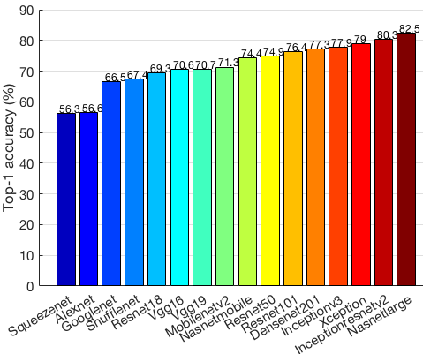
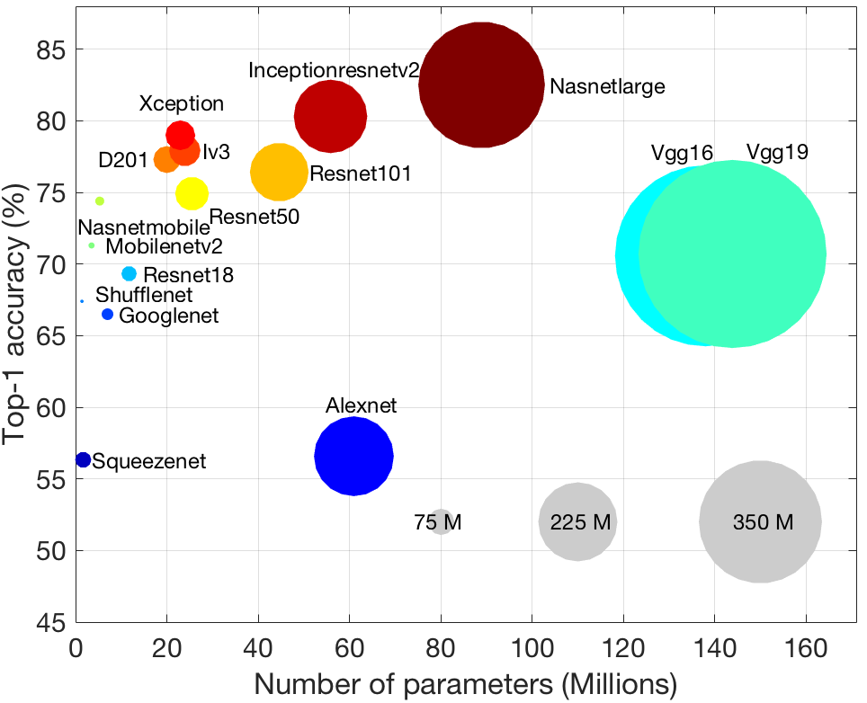
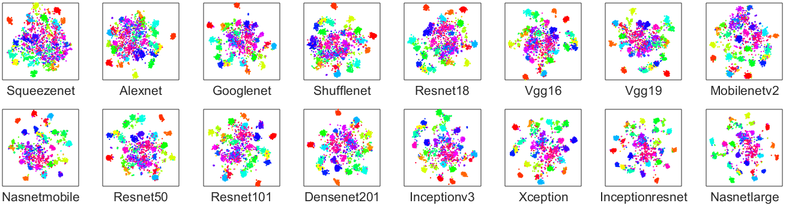
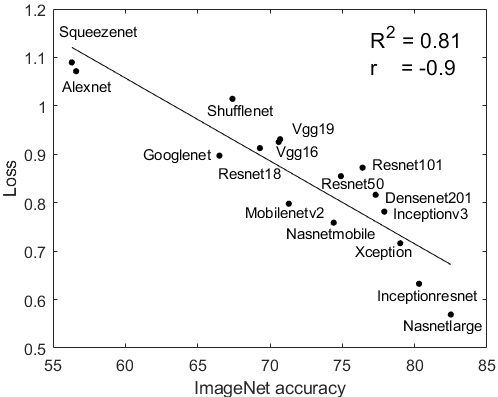
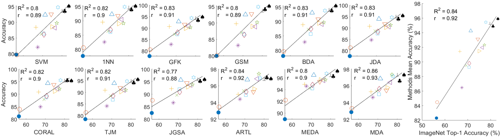
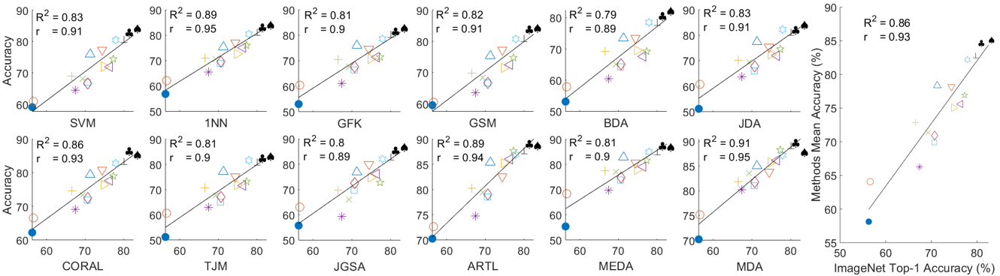
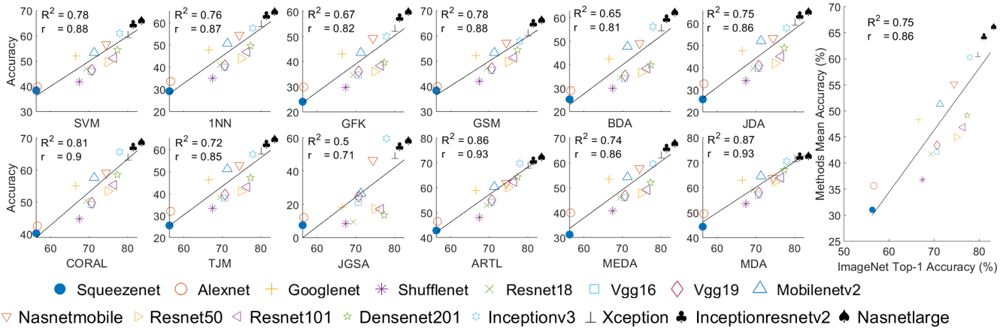
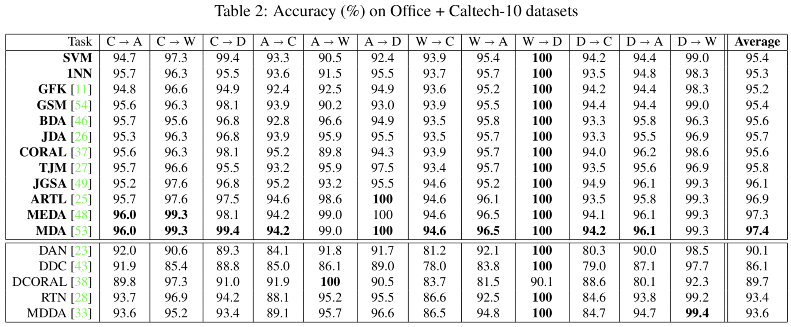
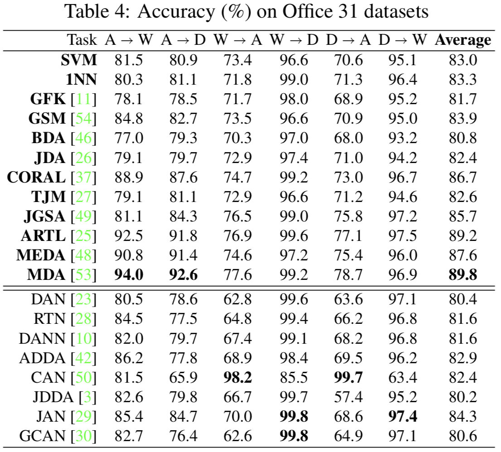
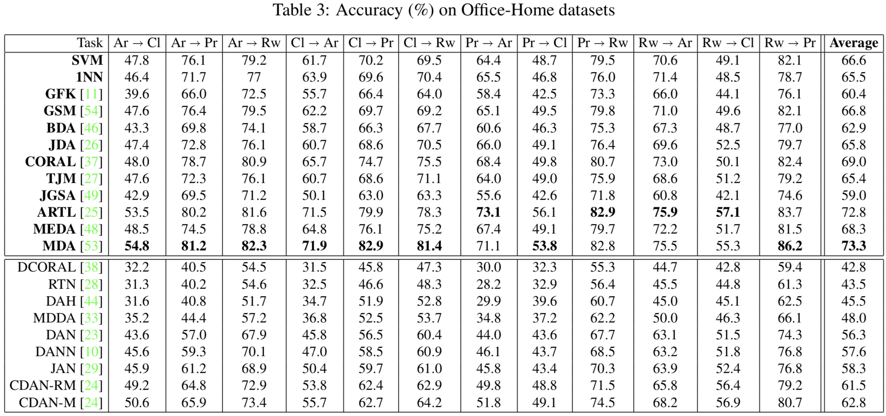

# Impact-of-ImageNet-Model-Selection-on-Domain-Adaptation
<!--  <hr width=”200″ align=”left”>  -->
This directory contains the code for paper [Impact of ImageNet Model Selection on Domain Adaptation](http://openaccess.thecvf.com/content_WACVW_2020/papers/w3/Zhang_Impact_of_ImageNet_Model_Selection_on_Domain_Adaptation_WACVW_2020_paper.pdf), which is accepted by In 2020 IEEE Winter Applications of Computer Vision Workshops (WACVW).

And the code for paper [Modified Distribution Alignment for Domain Adaptation with Pre-trained Inception
ResNet](https://arxiv.org/pdf/1904.02322.pdf).

If you have any questions, please email to yoz217@lehigh.edu
### Reference

If you find it is helpful, please cite it as:

`
Zhang, Youshan, and Brian D. Davison. (2020). Impact of ImageNet Model Selection on Domain Adaptation. In 2020 IEEE Winter Applications of Computer Vision Workshops (WACVW).
`

`
Zhang, Y., & Davison, B. D. (2019). Modified distribution alignment for domain adaptation with pre-trained inception resnet. arXiv preprint arXiv:1904.02322.
`

Or in bibtex style:

```
@article{zhang2020impact,
  title={Impact of ImageNet Model Selection on Domain Adaptation},
  author={Zhang, Youshan and Davison, Brian D},
  booktitle={In 2020 IEEE Winter Applications of Computer Vision Workshops (WACVW)},
  year={2020}
}
@article{zhang2019modified,
  title={Modified distribution alignment for domain adaptation with pre-trained inception resnet},
  author={Zhang, Youshan and Davison, Brian D},
  journal={arXiv preprint arXiv:1904.02322},
  year={2019}
}
```

### To run the code

Open Matlab (Matlab2017a version or later should be fine)

Run ImageNet_Model_Selection.m

The newest mean accuracy of the Office+Caltech-10 dataset is around 97.5%.

## Figures
   

<p align="center">ImageNet Accuracy & Parameters & Memory</p>

 

<p align="center"> T-SNE view of extracted features of Amazon domain in the Office31 dataset</p>

<p align="center">
  
</p>

<p align="center"> T-SNE loss of sixteen neural networks of domain Amazon in the office31 dataset</p>

## Results
 
<p align="center"> Correlation and R square value of Office+Caltech-10 dataset </p>

 
<p align="center"> Correlation and R square value of Office31 dataset </p>


<p align="center"> Correlation and R square value of Office-Home dataset </p>




<p align="center">
  
</p>


